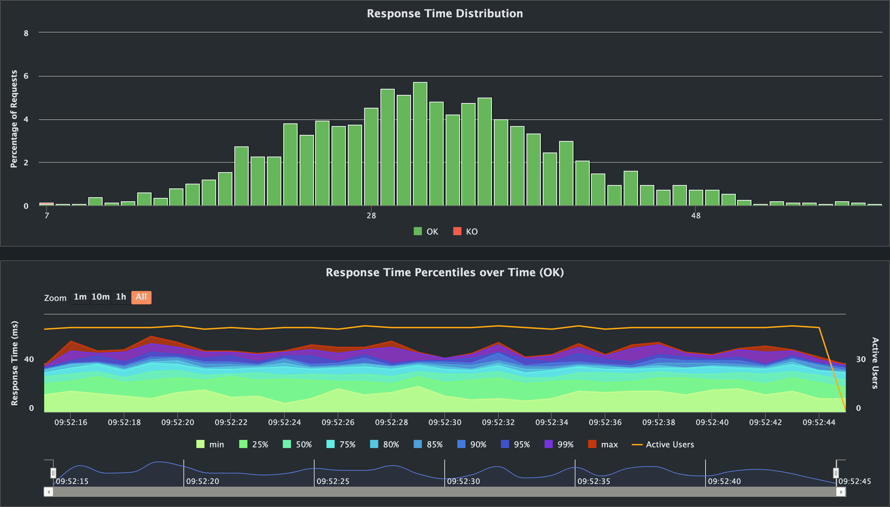
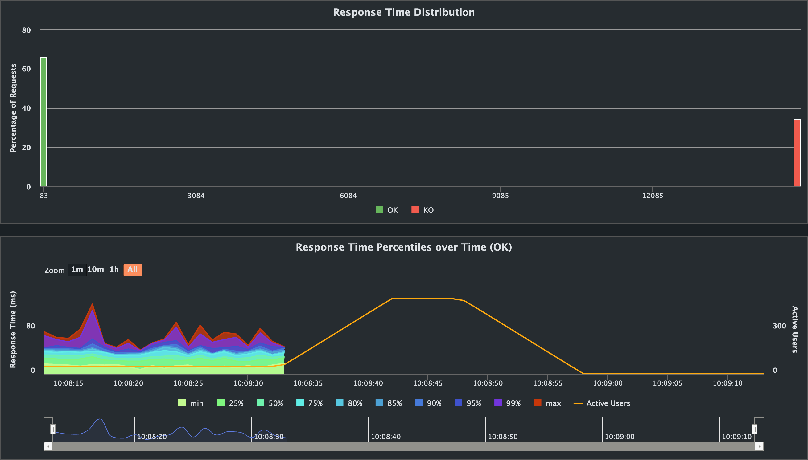

## Modules:
* **java-app** - a simple Demo Bank app to demonstrate common multithreading issues. It uses in memory `ArrayList` and `Thread.sleep(...)` to simulate DataBase operations
* **load-generator** - a module running pre-defined load tests using Gatling.

# Running locally
Requires JDK17+ installed on your machine.

## Starting app
Use 
```shell
./gradlew clean build && java -jar java-app/build/libs/java-app-1.0.jar
```
to run the app. Verify app state by running
```
HTTP GET http://localhost:8080/api/v1/total-assets
```
request. You will see ten bank accounts, each with 1000 account balance:
```json
{
  "totalBalance": "10000.00",
  "accounts": [
    {
      "accountNumber": "1",
      "balance": "1000.00"
    },
    {
      "accountNumber": "2",
      "balance": "1000.00"
    },
    ...
    {
      "accountNumber": "10",
      "balance": "1000.00"
    }
  ]
}
```

## Generating load to demonstrate common multithreading issues
### Scenario 1: Race condition
Run following command:
```shell
./gradlew :load-generator:gatlingRun-pl.lunasoftware.demo.threadssync.loadtest.BankTransferSimulation -Dmode=race    
```
This runs a Gatling load test sending 50 RPS to transfer random amount of monet between two randomly picked accounts.
Executed code can be found in [BankController#transferWithRace](java-app/src/main/java/pl/lunasoftware/demo/threadssync/bank/BankController.java#L22)
Executed code uses no threads synchronisation, leading to a race condition. Verify accounts balance after the load test finishes by sending the same
```
HTTP GET http://localhost:8080/api/v1/total-assets
```
request. With a bit of luck, you will see corrupted data, similar to this:
```json
{
  "totalBalance": "7705.00",
  "accounts": [
    {
      "accountNumber": "1",
      "balance": "675.00"
    },
    {
      "accountNumber": "2",
      "balance": "401.00"
    },
    ...
    {
      "accountNumber": "10",
      "balance": "914.00"
    }
  ]
}
```
Total balance of all accounts has changed. Despite the severe bug, code execution is fast:


### Scenario 2: Performance hit
Run following command:
```shell
./gradlew :load-generator:gatlingRun-pl.lunasoftware.demo.threadssync.loadtest.BankTransferSimulation -Dmode=slow    
```
This runs a Gatling load test sending again 50 RPS to transfer random amount of monet between two randomly picked accounts.
Executed code can be found in [BankController#transferSlow](java-app/src/main/java/pl/lunasoftware/demo/threadssync/bank/BankController.java#L28)
Executed code uses naive threads synchronisation, where only one bank transfer can be executed simultaneously, leading to a severe performance issues. The application state is not corrupted, though.
Verify accounts balance after the load test finishes by sending the same
```
HTTP GET http://localhost:8080/api/v1/total-assets
```
request. You will unchanged total balance of 10000.00:
```json
{
  "totalBalance": "10000.00",
  "accounts": [
    {
      "accountNumber": "1",
      "balance": "924.00"
    },
    {
      "accountNumber": "2",
      "balance": "779.00"
    },
   ...
    {
      "accountNumber": "10",
      "balance": "1362.00"
    }
  ]
}
```
Code execution has greatly slowed down:


### Scenario 3: Deadlock
Run following command:
```shell
./gradlew :load-generator:gatlingRun-pl.lunasoftware.demo.threadssync.loadtest.BankTransferSimulation -Dmode=deadlock    
```
This runs a Gatling load test sending once again 50 RPS to transfer random amount of monet between two randomly picked accounts.
Executed code can be found in [BankController#transferWithDeadlock](java-app/src/main/java/pl/lunasoftware/demo/threadssync/bank/BankController.java#L33)
Executed code uses synchronization on accounts involved in a given bank transfer. Nested `synchronized` blocks may lead to a deadlock. With a bit of luck the application will stop working after a few (or several dozen) seconds. It will stuck and will be unresponsive to any HTTP requests due to depleted Tomcat pool thread. 200 threads will wait for each other.
You will see many timed-out requests in Gatling report:

Application will need a restart to make it work again.

### Scenario 4: Correct synchronization
Run following command:
```shell
./gradlew :load-generator:gatlingRun-pl.lunasoftware.demo.threadssync.loadtest.BankTransferSimulation   
```
This runs a Gatling load test sending yet again 50 RPS to transfer random amount of monet between two randomly picked accounts.
Executed code can be found in [BankController#transfer](java-app/src/main/java/pl/lunasoftware/demo/threadssync/bank/BankController.java#L39)
Executed code uses synchronization on accounts involved in a given bank transfer. Nested `synchronized` blocks are acquired and released in an ordered fashion, avoiding a deadlock condition.
You can verify correct application state by running the same
```
HTTP GET http://localhost:8080/api/v1/total-assets
```
request. You will see correct total balance of 10000.00:
```json
{
  "totalBalance": "10000.00",
  "accounts": [
    {
      "accountNumber": "1",
      "balance": "673.00"
    },
    {
      "accountNumber": "2",
      "balance": "2094.00"
    },
    ...
    {
      "accountNumber": "10",
      "balance": "1564.00"
    }
  ]
}
```
The response times are also much better:


## Hints
Results of the simulations greatly depend on you machine performance and generated load by the Gatling.
You can change sent RPS in [[BankTransferSimulation](load-generator/src/gatling/java/pl/lunasoftware/demo/threadssync/loadtest/BankTransferSimulation.java#26).
